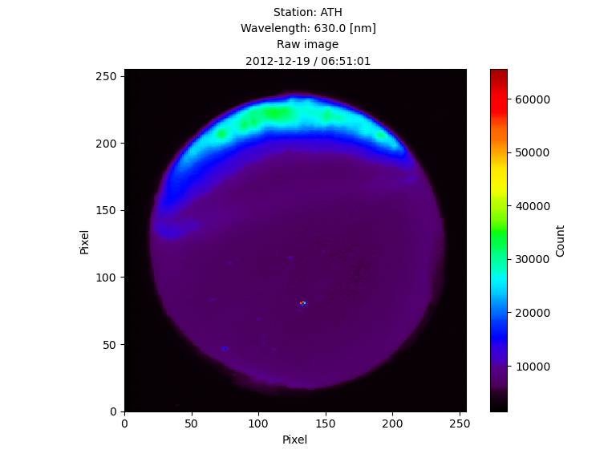
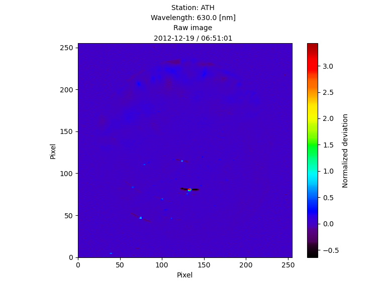
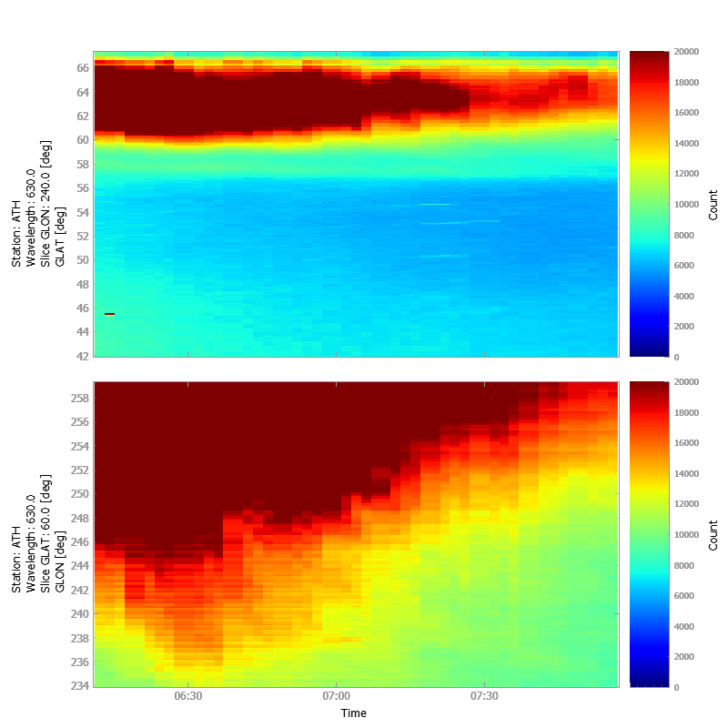

# pyspedas\_plugin\_camera

Development of Optical Mesosphere Thermosphere Imagers (OMTI) data analysis tool for pySPEDAS.

## Installing

### 1. Installing Python

Under Windows OS, install Anaconda (https://www.anaconda.com/products/distribution). Install Anaconda with **"For all users"** and **"Add to PATH environment variable"** options.

Under GNU/Linux, Python is usually already installed. Otherwise, follow instructions for your Linux distribution.

### 2. Installing pySPEDAS

Install pyspedas and pyspedas_examples packages into your Python environment. If you use **pip**, enter in a command line:

```
pip install pyspedas
```

```
pip install arase_examples
```

## Examples

### ex_camera.py

*ex_camera.py* located in *arase_examples/ground_omti* can be merged with *arase_examples* or run independently (in a IDE like VS Code, PyCharm etc. or using *run_ex_camera.bat* in Windows OS).

After running the script, required data files are being loaded (if needed) and a message is printed:

```
======== Testing of functions ========

1. Plot a raw image in pixels
2. Plot a dev image in pixels
3. Plot a raw image in geographic coordinates
4. Plot a dev image in geographic coordinates
5. Plot raw keograms
6. Plot dev keograms
7. Remove star lights from a raw image (for demonstration only)
Please, pick the number:
```

If you enter **1**, a figure below is shown:



The results for **2**-**7** options are shown below:

Figure 2:



Figure 3:


Figure 4:


Figure 5:



Figure 6:


Figure 7:


Parameters for plotting images (time range, station code, wavelenths, mapping altitude, latitude, longitude etc.) are stored in **data** dictionary:

```
    data = {
        't_range': ['2012-12-19 06:00:00', '2012-12-19 08:00:00'],
        'site': 'ath',
        'wavelength_ag': '6300',
        'wavelength_bg': '5577',
        'time': None,
        'pixels': {'x_min': 0,
                   'y_min': 0,
                   'x_max': None,
                   'y_max': None},
        'coords': {'x_min': None,
                   'y_min': None,
                   'x_max': None,
                   'y_max': None},
        'raw': {'z_min': 0,
                'z_max': 20000},
        'dev': {'z_min': -0.2,
                'z_max': 0.2},
        'mapping_alt': '400',
        'grid': 0.1,
        'map_size': None,
        'in_km': False,
        'lat': 60.0,
        'lon': 240.0
    }
```


## 1. Data load part

### camera_omti_asi.py

Load the OMTI ASI data from the ISEE ERG-SC site.

```
def camera_omti_asi(
    trange=['2020-08-01', '2020-08-02'],
    suffix='',
    site='all',
    wavelength=[5577],
    get_support_data=False,
    varformat=None,
    varnames=[],
    downloadonly=False,
    notplot=False,
    no_update=False,
    uname=None,
    passwd=None,
    time_clip=False,
    ror=True
    )
```

Parameters:

**trange**: time range of interest (2 element array)

**site**: Observatory name, example, erg_load_camera_omti_asi, site='sgk'. The default is 'all', i.e., load all available stations. This can be an array of strings, e.g., ['sgk', 'sta'] or a single string delimited by spaces, e.g., 'sgk sta'. Sites: abu ath drw eur gak hlk hus isg ist ith kap ktb mgd nai nyr ptk rik rsb sgk sta syo trs yng

**wavelength**: Wavelength in Angstrom, i.e., 5577, 6300, 7200, 7774, 5893, etc. The default is 5577. This can be an array of integers, e.g., [5577, 6300] or strings, e.g., '5577', '5577 6300', and ['5577', '6300'].

**downloadonly**: if set, then only download the data, do not load it into variables


## 2. Analysis part

### tabsint.py

Calculates the absolute intensity [R] with raw, background, and calibration data, and store tplot variable.

```
def tabsint(
    site, 
    wavelength=[6300,5725]
    )
```

Parameters:

**site**: ABB code of observation site

**wavelength**: wavelength of airglow and background image data

### tabsint_nobg.py

Calculates the absolute intensity [R] with raw and calibration data, and store tplot variable.

```
def tabsint_nobg(
    site,
    wavelength
    )
```

### tasi2gmap.py

Create the image data in geographic coordinates, and store tplot variable.

```
def tasi2gmap(
    vname1, 
    vname2
    )
```

Parameters:

**vname1**: tplot variable of airgrow data

**vname2**: tplot variable of map table data

### search_omti_calibration_file.py

Select the OMTI calibration file for site and wavelength at the specified date.

```
def search_omti_calibration_file(
    date, 
    site, 
    wavelength, 
    wid_cdf, 
    wid0
    )
```

Parameters:

**date**: Unix time

**site**: Site name (ABB code)

**wavelength**: Observed wavelength for airglow

**wid0**: 2x2 binning window

### tmake_image_dev.py

Calculates the deviation of image data from 1-hour verage data and store tplot variable.

```
def tmake_image_dev(
    v_name, 
    width=3600.
    )
```

Parameters:

**vname**: tplot variable of image data

**width**: Period of data window to calculate the average value. The default is 3600 sec.

### tmake_map_table.py

Create the mapping table in geographic coordinates, and store tplot variable.

```
def tmake_map_table(
    vname, 
    mapping_alt_km=110, 
    grid=None, 
    mapsize=None, 
    in_km=False
    )
```

Parameters:

**vname**: tplot variable of airgrow data

**mapping_alt_km**: Mapping altitude. The default is 110 km

**grid**: grid size

**mapsize**: map size. The default is an original image size

**in_km**: if True, unit is km

### rm_star_absint.py

Remove star lights with a median filter.

```
def rm_star_absint(
    img0, 
    img_size=512
    )
```

Parameters:

**img0**: input the image data

**img_size**: imput image size (512 or 256)

Return:

Output image data without the star lights

### omti_attitude_params.py

Output the OMTI Imager Attitude Parameters for Coordinate Transformation.

```
def omti_attitude_params(
    date='2015-05-18T00:00:00', 
    site='sgk'
    )
```

Parameters:

**date**: time (datetime, string, int, float, np.integer, np.float64)

**site**: site name (ABB code)

Return:

```
namedtuple('Attitude',
    [
    'lon_obs',  # longitude of observation site [deg] 
    'lat_obs',  # latitude of observation site [deg]
    'alt_obs',  # altitude of observation site [km]
    'xm',  # x-location of the maximum elevation in an image map
    'ym',  # y-location of the maximum elevation in an image map
    'a_val', # A value = image diameter(pixel)/3.14159
    'rotation' # rotation angle [deg]
    ]
    )
```

### keogram_image.py

Create the keogram of image data at a spesific location.

```
def keogram_image(
    vname, 
    lat=60.0, 
    lon=240.0
    )
```

Parameters:

**vname**: tplot variable of image data

**lat**: latitude

**lon**: longitude


## 3. Plot part

### plot_omti_image.py

Create the two-dimensional map of image data.

```
def plot_omti_image(
    v_name, 
    time=None,
    x_max=None, 
    y_max=None, 
    z_max=None,
    x_min=0, 
    y_min=0, 
    z_min=None,
    cmap=None,
    factor=1
    )
```

Parameters:

**vname**: tplot variable of image data

**time**: plot time. The default is start time of tplot variable

**x_min**: minimum value of x range. The default is the minimum value of image size

**x_max**: maximum value of x range. The default is the maximum value of image size

**y_min**: minimum value of y range. The default is the minimum value of image size

**y_max**: maximum value of y range. The default is the maximum value of image size

**z_min**: minimum value of z range. The default is the minimum value of image data

**z_max**: maximum value of z range. The default is the maximum value of image data

**cmap**: color map. If None, SPEDAS color map is used

**factor**: factor for rescaling the figure

### plot_omti_gmap.py

Create the two-dimensional map of image data in geographic coordinates.

```
def plot_omti_gmap(
    vname, 
    time, 
    x_min, 
    x_max, 
    y_min, 
    y_max, 
    z_min, 
    z_max
    )
```

Parameters:

**vname**: tplot variable of image data

**time**: plot time. The default is start time of tplot variable

**x_min**: minimum value of x range. The default is the minimum value of image size

**x_max**: maximum value of x range. The default is the maximum value of image size

**y_min**: minimum value of y range. The default is the minimum value of image size

**y_max**: maximum value of y range. The default is the maximum value of image size

**z_min**: minimum value of z range. The default is the minimum value of image data

**z_max**: maximum value of z range. The default is the maximum value of image data


