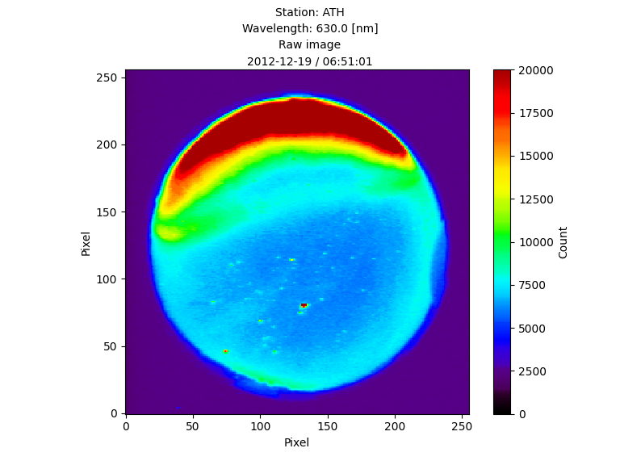
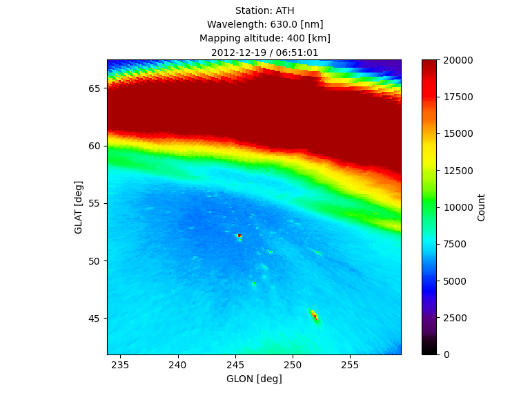
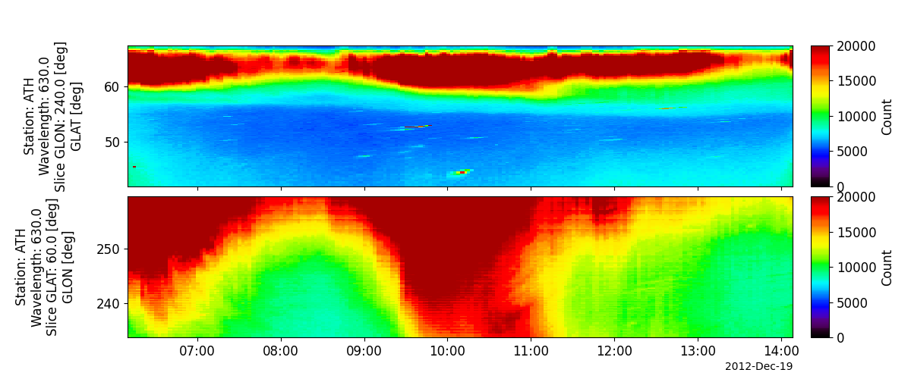
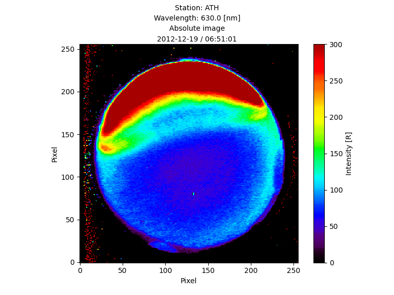
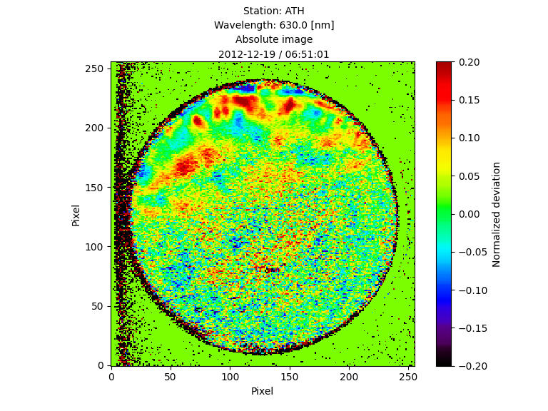
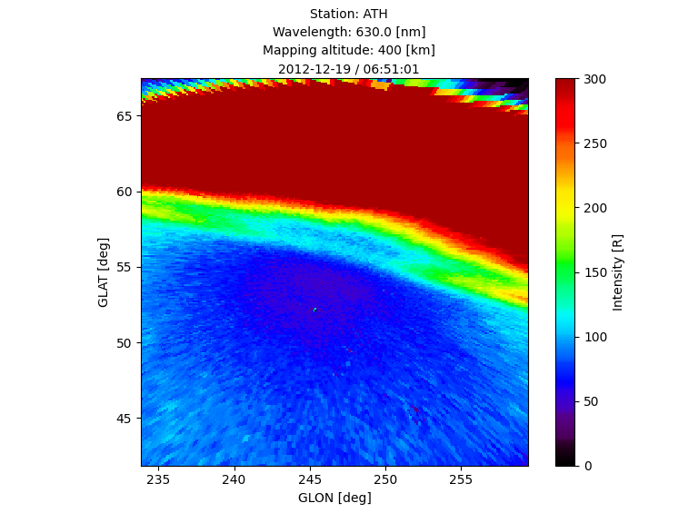
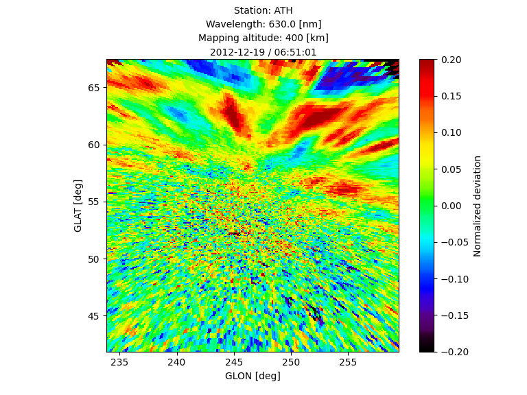
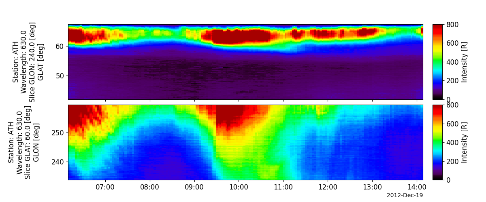
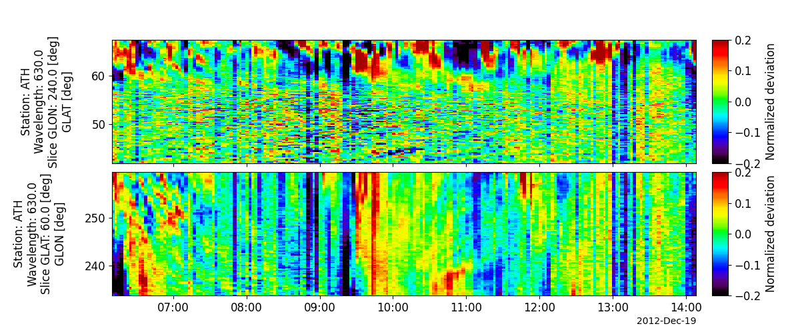

# pyspedas\_plugin\_camera

Development of Optical Mesosphere Thermosphere Imagers (OMTI) data analysis tool for pySPEDAS.

## Synopsis

The package is developed to promote effective use of the OMTI CDF (Common Data Format) data that are open from the ERG-SC website. This includes Several OMTI data analysis tools for pySPEDAS.

The package enables easy analysis of OMTI image data obtained at all sites, comprehensively, on the common platform and their comparison with other observation data (GPS-TEC, SuperDARN, magnetic field and satellites).

## Installing

### 1. Installing Python

Under Windows OS, install Anaconda (https://www.anaconda.com/products/distribution). Install Anaconda with **"For all users"** and **"Add to PATH environment variable"** options.

Under GNU/Linux, Python is usually already installed. Otherwise, follow instructions for your Linux distribution.

### 2. Installing pySPEDAS

Install pyspedas and pyspedas_examples packages into your Python environment. If you use **pip**, enter in a command line:

```
pip install pyspedas
```

```
pip install pyspedas_examples
```

### 3. Cloning a repository of the current project

Install **git** software. 

You must be in **Collaborators** group of the project. If not, ask to add you.

Clone a repository:

```
git clone https://github.com/Albom/pyspedas_plugin_camera.git
```

### 4. Modifying the original pyspedas package

Directory structure of the current project is similar to pySPEDAS package structure. 

In general, path to Python packages installed is &lt;virtualenv_name>/lib/&lt;python_ver>/site-packages.

If pySPEDAS is installed in Anaconda under Windows OS, the path to the **pyspedas** package is *C:\\ProgramData\\Anaconda3\\Lib\\site-packages\\pyspedas\\*.

You need to copy *pyspedas* directory to pySPEDAS package. File *\_\_init\_\_.py* is being copied to *erg* directory and other files are being copyied to *erg/ground/camera* directory.

### 5. Building a manual

Manual for the project (*Manual.md* in *manual* directory) is written using Markdown language. It can be viewed in GitHub web interface or converted to Microsoft Word DOCX format using script *to_docx.py*:

```
python to_docx.py
```

After that, DOCX can be converted (Microsoft Office should be installed) to PDF:

```
python to_pdf.py
```

## Examples

### ex_raw_image.py

*ex_raw_image.py* located in *pyspedas_examples/examples* can be merged with *pyspedas_examples* or run independently (in a IDE like VS Code, PyCharm etc.).

This script is created to test the capabilities of demonstrating such raw data images as raw image in pixels, raw image in geographic coordinates and raw keograms.

Parameters for plotting images (time range, station code, wavelengths, mapping altitude, latitude, longitude etc.) are stored in **data** dictionary:

```
    data = {
        't_range': ['2012-12-19 06:00:00', '2012-12-19 15:00:00'],
        'site': 'ath',
        'wavelength': 6300,
        'time': '2012-12-19 06:51:01',
        'pixels': {'x_min': 0,
                   'y_min': 0,
                   'x_max': None,
                   'y_max': None},
        'coords': {'x_min': None,
                   'y_min': None,
                   'x_max': None,
                   'y_max': None},
        'raw': {'z_min': 0,
                'z_max': 20000},
        'mapping_alt': '400',
        'grid': 0.1,
        'map_size': None,
        'in_km': False,
        'lat': 60.0,
        'lon': 240.0
    }
```

After running the script, required data files are being loaded (if needed) and a message is printed:

```
======== Testing of functions ========

1. Plot a raw image in pixels
2. Plot a raw image in geographic coordinates
3. Plot raw keograms
Please, pick the number:
```

Below are the examples of figures for default settings.

If you enter **1**, the result as a figure below is shown:



The results for **2** and **3** options are shown below:

Figure 2:



Figure 3:



### ex_abs_image.py

*ex_abs_image.py* located in *pyspedas_examples/examples* can be merged with *pyspedas_examples* or run independently (in a IDE like VS Code, PyCharm etc.).

This script is created to test the capabilities of demonstrating both absolute intensity \[R\] data images and deviations of image data from 1-hour average data images as absolute and deviation images in pixels, absolute and deviation images in geographic coordinates, absolute and deviation keograms.

Parameters for plotting images (time range, station code, wavelenths, mapping altitude, latitude, longitude etc.) are stored in **data** dictionary:

```
    data = {
        't_range': ['2012-12-19 06:00:00', '2012-12-19 15:00:00'],
        'site': 'ath',
        'wavelength_ag': 6300,
        'wavelength_bg': 5725,
        'time': '2012-12-19 06:51:01',
        'nobg': False,
        'pixels': {'x_min': 0,
                   'y_min': 0,
                   'x_max': None,
                   'y_max': None},
        'coords': {'x_min': None,
                   'y_min': None,
                   'x_max': None,
                   'y_max': None},
        'abs': {'z_min': 0,
                'z_max': 300},
        'abs_keo': {'z_min': 0,
                    'z_max': 800},
        'dev': {'z_min': -0.2,
                'z_max': 0.2},
        'mapping_alt': '400',
        'grid': 0.1,
        'map_size': None,
        'in_km': False,
        'lat': 60.0,
        'lon': 240.0
    }
```

After running the script, required data files are being loaded (if needed) and a message is printed:

```
======== Testing of functions ========

1. Plot an absolute image in pixels
2. Plot a deviation of image data in pixels
3. Plot an absolute image in geographic coordinates
4. Plot a deviation of image data in geographic coordinates
5. Plot absolute keograms
6. Plot deviation of image data keograms
Please, pick the number:
```

Below are the examples of figures for default settings.

If you enter **1** or **2** , the resulted images in pixels as figures 4 or 5, respectively, are shown below:

Figure 4:



Figure 5:



If you enter **3** or **4** , the resulted images in geographic coordinates as figures 6 or 7, respectively, are shown below:

Figure 6:



Figure 7:



Finally. if you enter **5** or **6** , the resulted keograms as figures 8 or 9, respectively, are shown below:

Figure 8:



Figure 9:



### ex_omti_attitude_params.py

*ex_omti_attitude_params.py* located in *pyspedas_examples/examples* is used to show how *omti_attitude_params* (from *pyspedas/erg/ground/camera/omti_attitude_params.py*) can be called.

Calling the *omti_attitude_params* function with default parameters values (date='2015-05-18T00:00:00', site='sgk'):

```
params = omti_attitude_params()
```

You can specify parameter names or pass their values directly:

```
params = omti_attitude_params(date='2018-09-12T00:00:00', site='nai')
params = omti_attitude_params('2015-05-18T00:00:00', 'eur')
params = omti_attitude_params('2009-01-11/00:00:00', 'TRS')
```

Site name is a string (no matter you use UPPER or lower or mIxEd case). 

Date can be a string in ISO format as well as a floating point number or integer:

```
date_double = time_double('2005-01-01 00:00')

params = omti_attitude_params(date_double, 'Rsb')
params = omti_attitude_params(int(date_double), 'Rsb')
params = omti_attitude_params(np.intc(date_double), 'Rsb')
params = omti_attitude_params(np.float64(date_double), 'Rsb')
```

### ex_search_omti_calibration_file.py

*ex_search_omti_calibration_file.py* located in *pyspedas_examples/examples* is used to show what *search_omti_calibration_file* (from *pyspedas/erg/ground/camera/search_omti_calibration_file.py*) returns.

This example contains a list of parameters that are passed to *search_omti_calibration_file* function one after another in a loop:

```

    test_data = [
                 [],
                 ['2016-01-01/00:00:00', 'eur', 5577, 1],
                 ['2016-01-01/00:00:00', 'eur', 6300, 1], 
                 [],
                 ['2006-01-01/00:00:00', 'rsb', 7774, 1], 
                 [],
                 ['2018-01-01/00:00:00', 'ist', 5577, 1], 
                 ['2018-01-01/00:00:00', 'ist', 4861, 1], 
                 [],
                 ['2010-01-01/00:00:00', 'trs', 6300, 1], 
                 ['2010-01-01/00:00:00', 'trs', 5893, 1], 
                 ['2010-01-01/00:00:00', 'trs', 7320, 1], 
                 [],
                 ['2018-01-01/00:00:00', 'hus', 5577, 1],
                 [],
                 ['2019-01-01/00:00:00', 'nai', 6300, 1],
                 [],
                 ['2014-11-18T00:00:00', 'ath', 5893, 1],
                 ['2014-11-17T23:59:59', 'ath', 5893, 1],
                 ['2015-01-01T00:00:00', 'ath', 8446, 1],
                 [],
                 ['2020-01-01T00:00:00', 'zgn', 4861, 1],
                 [],
                 ['2018-01-01T00:00:00', 'gak', 5577, 1],
                 [],
                 ['2018-01-01T00:00:00', 'nyr', 6300, 1],
                 [],
                 ['2018-01-01T00:00:00', 'kap', 6300, 1],
                 [],
                 ['2007-01-01T00:00:00', 'ith', 5577, 1],
                 [],
                 ['2009-01-01T00:00:00', 'mgd', 4861, 1],
                 ['2017-01-01T00:00:00', 'mgd', 4861, 1],
                 [],
                 ['2008-01-01T00:00:00', 'ptk', 5577, 1],
                 [],
                 ['2000-01-01T00:00:00', 'rik', 5577, 1],
                 ['2010-01-01T00:00:00', 'rik', 5577, 1],
                 [],
                 ['1999-01-01T00:00:00', 'sgk', 5577, 1],
                 ['2005-01-01T00:00:00', 'sgk', 5577, 1],
                 ['2010-01-01T00:00:00', 'sgk', 5577, 1],
                 ['2013-01-01T00:00:00', 'sgk', 5577, 1],
                ]

```

Empty lists are used for making indents.

Calling a function in a such way:

```
data_output = search_omti_calibration_file(*data_input)
```

when 

```
data_input = ['2016-01-01/00:00:00', 'eur', 5577, 1]
```

means:

```
data_output = search_omti_calibration_file(date='2016-01-01/00:00:00', site='eur', wavelength=5577, wid_cdf=1)
```

In the result *Calibration* named tuple is returned:

```
Calibration(filename_ch='MFC10001.OUT', filename_5='MFC50001.OUT', width=2)
```

*filename_ch* and *filename_5* contain file names from *calibrated_files.zip* (it is loaded from *https://stdb2.isee.nagoya-u.ac.jp/omti/data/* by *tabsint* or *tabsint_nobg* functions). *width* contains the resulting window width and it can be original window width or doubled value or quadrupled value. Thats why *wid_cdf* parameter value is set to 1 in this example. 

## 1. Data load part

### camera_omti_asi.py

Load the OMTI ASI data from the ISEE ERG-SC site.

```
def camera_omti_asi(
    trange=['2020-08-01', '2020-08-02'],
    suffix='',
    site='all',
    wavelength=[5577],
    get_support_data=False,
    varformat=None,
    varnames=[],
    downloadonly=False,
    notplot=False,
    no_update=False,
    uname=None,
    passwd=None,
    time_clip=False,
    ror=True
    )
```

Parameters:

**trange**: time range of interest (2 element array)

**site**: Observatory name, example, erg_load_camera_omti_asi, site='sgk'. The default is 'all', i.e., load all available stations. This can be an array of strings, e.g., ['sgk', 'sta'] or a single string delimited by spaces, e.g., 'sgk sta'. Sites: abu ath drw eur gak hlk hus isg ist ith kap ktb mgd nai nyr ptk rik rsb sgk sta syo trs yng

**wavelength**: Wavelength in Angstrom, i.e., 5577, 6300, 7200, 7774, 5893, etc. The default is 5577. This can be an array of integers, e.g., [5577, 6300] or strings, e.g., '5577', '5577 6300', and ['5577', '6300'].

**downloadonly**: if set, then only download the data, do not load it into variables


## 2. Analysis part

### tabsint.py

Calculates the absolute intensity [R] with raw, background, and calibration data, and store tplot variable.

```
def tabsint(
    site, 
    wavelength=(6300,5725)
    )
```

Parameters:

**site**: ABB code of observation site

**wavelength**: wavelength of airglow and background image data

### tabsint_nobg.py

Calculates the absolute intensity [R] with raw and calibration data, and store tplot variable.

```
def tabsint_nobg(
    site,
    wavelength
    )
```
Parameters:

**site**: ABB code of observation site

**wavelength**: wavelength of airglow image data

### tasi2gmap.py

Create the image data in geographic coordinates, and store tplot variable.

```
def tasi2gmap(
    v_name1, 
    v_name2
    )
```

Parameters:

**v_name1**: tplot variable of airgrow data

**v_name2**: tplot variable of map table data

### search_omti_calibration_file.py

Select the OMTI calibration file for site and wavelength at the specified date.

```
def search_omti_calibration_file(
    date, 
    site, 
    wavelength, 
    wid_cdf
    )
```

Parameters:

**date**: Unix time

**site**: Site name (ABB code)

**wavelength**: Observed wavelength for airglow

**wid_cdf**: width of image

### tmake_image_dev.py

Calculates the deviation of image data from 1-hour average data and store tplot variable.

```
def tmake_image_dev(
    v_name, 
    width=3600.
    )
```

Parameters:

**v_name**: tplot variable of image data

**width**: Period of data window to calculate the average value. The default is 3600 sec.

### tmake_map_table.py

Create the mapping table in geographic coordinates, and store tplot variable.

```
def tmake_map_table(
    v_name, 
    mapping_alt=110, 
    grid=None, 
    mapsize=None, 
    in_km=False
    )
```

Parameters:

**v_name**: tplot variable of airgrow data

**mapping_alt**: Mapping altitude. The default is 110 km

**grid**: grid size

**mapsize**: map size. The default is an original image size

**in_km**: if True, unit is km

### rm_star_absint.py

Remove star lights with a median filter.

```
def rm_star_absint(
    img0, 
    img_size=512
    )
```

Parameters:

**img0**: input the image data

**img_size**: imput image size (512 or 256)

Return:

Output image data without the star lights

### omti_attitude_params.py

Output the OMTI Imager Attitude Parameters for Coordinate Transformation.

```
def omti_attitude_params(
    date='2015-05-18T00:00:00', 
    site='sgk'
    )
```

Parameters:

**date**: time (datetime, string, int, float, np.integer, np.float64)

**site**: site name (ABB code)

Return:

```
namedtuple('Attitude',
    [
    'lon_obs',  # longitude of observation site [deg] 
    'lat_obs',  # latitude of observation site [deg]
    'alt_obs',  # altitude of observation site [km]
    'xm',  # x-location of the maximum elevation in an image map
    'ym',  # y-location of the maximum elevation in an image map
    'a_val', # A value = image diameter(pixel)/3.14159
    'rotation' # rotation angle [deg]
    ]
    )
```

### keogram_image.py

Create the keogram of image data at a specific location.

```
def keogram_image(
    v_name, 
    lat=60.0, 
    lon=240.0
    )
```

Parameters:

**v_name**: tplot variable of image data

**lat**: latitude to create a longitude-time plot of image data

**lon**: longitude to create a latitude-time plot of image data


## 3. Plot part

### plot_omti_image.py

Create the two-dimensional map of image data.

```
def plot_omti_image(
    v_name, 
    time=None,
    x_max=None, 
    y_max=None, 
    z_max=None,
    x_min=0, 
    y_min=0, 
    z_min=None,
    cmap=None,
    factor=1
    )
```

Parameters:

**v_name**: tplot variable of image data

**time**: plot time. The default is start time of tplot variable

**x_min**: minimum value of x range. The default is the minimum value of image size

**x_max**: maximum value of x range. The default is the maximum value of image size

**y_min**: minimum value of y range. The default is the minimum value of image size

**y_max**: maximum value of y range. The default is the maximum value of image size

**z_min**: minimum value of z range. The default is the minimum value of image data

**z_max**: maximum value of z range. The default is the maximum value of image data

**cmap**: color map. If None, SPEDAS color map is used

**factor**: factor for rescaling the figure

### plot_omti_gmap.py

Create the two-dimensional map of image data in geographic coordinates.

```
def plot_omti_gmap(
    v_name,
    time=None,
    x_min=None,
    x_max=None,
    y_min=None,
    y_max=None,
    z_min=None,
    z_max=None,
    cmap=None,
    factor=1
    )
```

Parameters:

**v_name**: tplot variable of image data

**time**: plot time. The default is start time of tplot variable

**x_min**: minimum value of x range. The default is the minimum value of image size

**x_max**: maximum value of x range. The default is the maximum value of image size

**y_min**: minimum value of y range. The default is the minimum value of image size

**y_max**: maximum value of y range. The default is the maximum value of image size

**z_min**: minimum value of z range. The default is the minimum value of image data

**z_max**: maximum value of z range. The default is the maximum value of image data

**cmap**: color map. If None, SPEDAS color map is used

**factor**: factor for rescaling the figure
